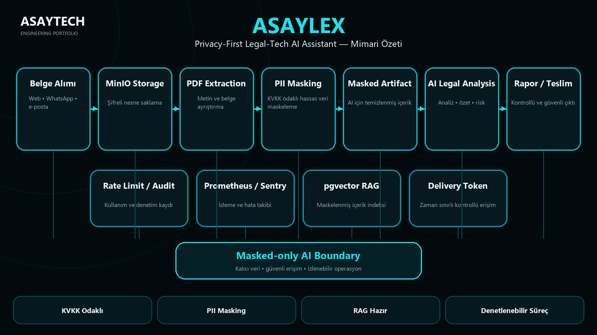

# ASAYLEX — Privacy-First Legal-Tech AI Assistant

ASAYLEX is a KVKK-oriented legal-tech AI system for receiving legal documents, extracting text, masking personally identifiable information and performing AI-assisted analysis through a privacy-first boundary.

## What It Solves
Legal documents contain highly sensitive personal and case data. ASAYLEX is designed so raw document content is processed and masked before AI analysis, RAG indexing or optional external research integrations.

## Core Pipeline
`Document Intake → MinIO Object Storage → PDF Text Extraction → PII Detection & Masking → Masked Artifact → AI Legal Analysis → Controlled Report Delivery`

Supporting layers include a masked-only pgvector RAG index, rate limiting, retention/audit controls, Prometheus/Sentry observability and optional masked-only NotebookLM MCP integration.

## Core Capabilities
- Web / WhatsApp / e-mail document intake
- PDF text extraction
- PII detection and masking
- Masked-only AI analysis boundary
- Masked-only pgvector RAG indexing
- Controlled report delivery tokens
- Celery/Redis asynchronous processing
- MinIO object storage
- Prometheus metrics and Sentry observability
- Retention, rate limiting and audit controls

## Engineering Stack
Python · FastAPI · Celery · Redis · PostgreSQL/pgvector · MinIO · PyMuPDF · Anthropic/OpenRouter-compatible LLM providers · Prometheus · Sentry

## My Role
AI/privacy architecture, document-processing workflow design, PII masking boundary, RAG design, provider integration, production-readiness controls and observability architecture.

## Source Availability
Production source and all document/customer data remain private. This case study publishes only sanitized architecture and engineering evidence suitable for professional review.
