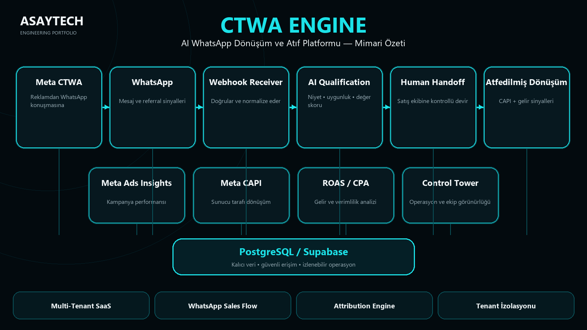

# CTWA Engine — AI WhatsApp Conversion & Attribution Platform

CTWA Engine connects Meta Click-to-WhatsApp advertising with AI lead qualification, WhatsApp sales conversations, human handoff and revenue attribution.

## What It Solves
Marketing teams often lose attribution after a prospect moves from an ad into WhatsApp. CTWA Engine preserves the ad-to-conversation relationship, qualifies the lead and records supported commercial outcomes.

## Core Pipeline
`Meta CTWA Ad → WhatsApp → Webhook → AI Lead Qualification → Human Handoff / Outbound → Attributed Conversion`

Supporting services connect Meta Ads Insights, Meta CAPI, ROAS/CPA/revenue signals and the operational control tower to a shared PostgreSQL/Supabase data layer.

## Core Capabilities
- Multi-turn AI lead qualification
- Human handoff for low-confidence and sensitive cases
- Outbound follow-up workflows
- Meta CAPI conversion feedback loop
- Meta Ads spend synchronization
- ROAS/CPA reporting
- Multi-tenant agency/workspace architecture
- Tenant isolation and AES-256-GCM credential encryption

## Engineering Stack
TypeScript · Node.js · Express · Next.js · Supabase/PostgreSQL · Row Level Security · Zod · Docker · Meta WhatsApp Cloud API · Meta Conversions API

## Verified Engineering Evidence
On 18 Sep 2026, a clean validation run completed with **163 automated tests passed** and **full workspace TypeScript typecheck passed**.

## My Role
Product architecture, AI agent workflow design, API orchestration, multi-tenant SaaS architecture, security controls, conversion attribution design, testing strategy and deployment engineering.

## Source Availability
Production source remains private. This case study exposes architecture and verified engineering evidence without publishing credentials, customer data or proprietary source code.
