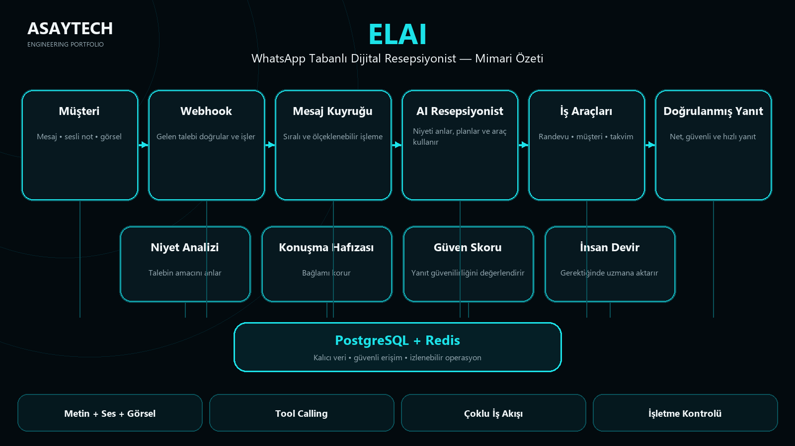

# ELAI — AI Receptionist & Business Assistant

ELAI is a WhatsApp-native multimodal AI receptionist and business assistant for appointment-driven local businesses.

## What It Solves
ELAI handles repetitive customer conversations, appointment operations and owner-side business tasks while keeping sensitive or low-confidence cases eligible for human handoff.

## Core Capabilities
- Understands text, voice notes and images
- Uses tool calling for appointment and business operations
- Separates customer tools from owner/management tools
- Supports human handoff and escalation
- Queue-based processing with Redis/BullMQ
- Transactional business state in PostgreSQL
- Docker-based production deployment

## Architecture
`WhatsApp → Webhook → Queue → AI Receptionist → Business Tools → PostgreSQL/Redis → Verified Response`

Supporting layers include intent analysis, conversation memory, confidence scoring and human escalation.

## Engineering Stack
TypeScript · Fastify · PostgreSQL · Redis/BullMQ · Evolution API · Docker · LLM Tool Calling · Voice Transcription · Vision

## Verified Engineering Evidence
On 18 Sep 2026, a clean validation run completed with **29 test files passed and 305/305 automated tests passed**.

## My Role
Product architecture, AI workflow design, backend architecture, integrations, security hardening, testing strategy and production deployment.

## Source Availability
The production source repository remains private/proprietary. This case study exposes architecture and verified engineering evidence without publishing production source, credentials, prompts or customer data.
